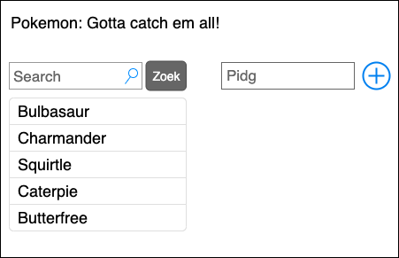

# Pokemon - Gotta catch them all!

## Opdracht 1

Een array is een variabele waar meer variabelen in zitten. Voor deze oefening maak je de array "pokemon" aan. In deze array stop je pokemon. Hoeveel, mag je zelf bepalen.
```javascript
var pokemon = [  
 "Slowbro",  
 "Pikachu",  
 "Charmander"  
];
```

Laat de eerste pokemon (let op: array positie is 0) zien met een Alert Box en pas de waarde van de tweede pokemon aan.

## Opdracht 2
Oei, je bent vergeten Bulbasaur er aan toe te voegen. Voeg deze er nog aan toe met de [array push](https://www.w3schools.com/jsref/jsref_push.asp) methode.

## Opdracht 3
Laat deze pokemon zien in een div op de webpagina. Hiervoor maak je een lege div met id "pokemon" aan. Om ze weer te geven heb je een [for loop](https://www.w3schools.com/js/js_loop_for.asp) nodig.
```html
<div id="pokemon">
	<!-- hier komen de pokemon in -->
</div>
```

Sorteer nog de pokemon op alfabet en laat deze in de pokemon-div zien. Maak gebruik van de [sort methode](https://www.w3schools.com/jsref/jsref_sort.asp).

## Opdracht 4
*Een mooie uitbreiding: maak een zoekfunctie waarmee je pokemon kan vinden. Maak gebruik van de [find methode](https://www.w3schools.com/jsref/jsref_find.asp). *



## Je maakt gebruikt van
- De DOM en Objecten [youtube](https://www.youtube.com/watch?v=k81rBKqwDhU)
- Arrays [youtube](https://www.youtube.com/watch?v=Z-l1IAbq3qg)
- Javascript Arrays [w3schools](https://www.w3schools.com/js/js_arrays.asp)
- For Loop [w3schools](https://www.w3schools.com/js/js_loop_for.asp)
- Array Push [w3schools](https://www.w3schools.com/jsref/jsref_push.asp)
- Sort methode [w3schools](https://www.w3schools.com/jsref/jsref_sort.asp)
- Find methode [w3schools](https://www.w3schools.com/jsref/jsref_find.asp)