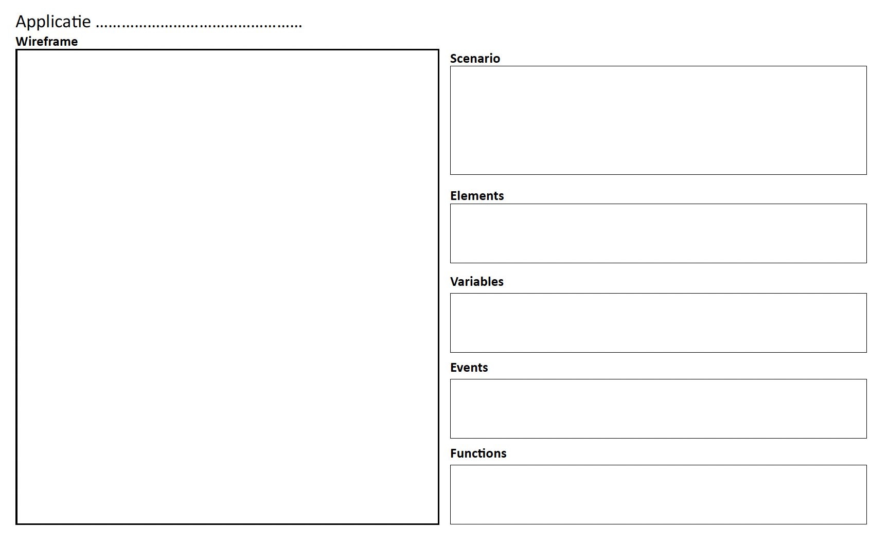

# Getting Started met een plan

Nu je bekend bent met de fundamentele concepten van JavaScript, ben je klaar om je eigen indrukwekkende applicatie te bouwen. Maar hoe start je hiermee? Een handige aanpak is het gebruik van deze [sjabloon](images/opzet-project.pdf). Deze sjabloon helpt je om een eenvoudige JavaScript-applicatie te bouwen. Het doel is om inzicht te krijgen in de basisprincipes van webontwikkeling. Door deze oefening leer je:
- Hoe je een gebruikersinterface (UI) schetst met een wireframe
- Hoe je een scenario opstelt waarin je de interactie tussen gebruiker en systeem beschrijft
- Hoe je elementen, variabelen, events en functies structureert in JavaScript

Deze aanpak is ideaal voor beginners en legt de basis voor complexere applicaties.

