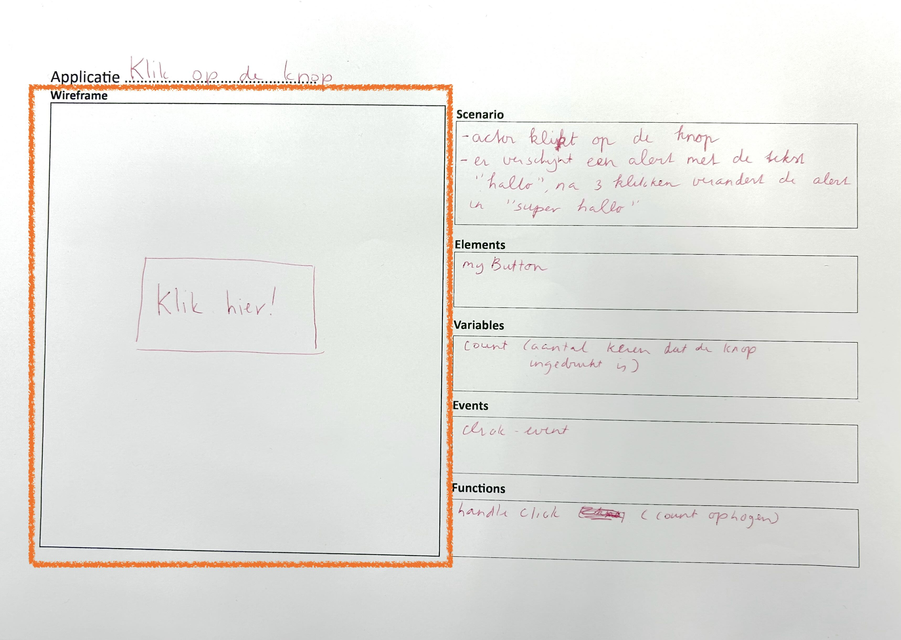
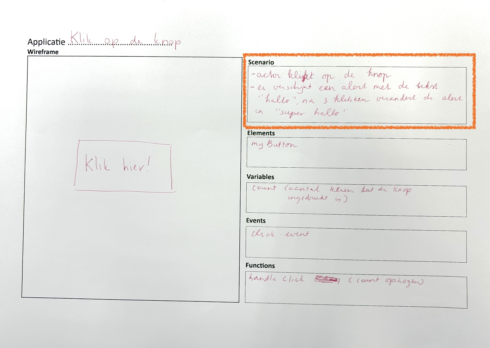
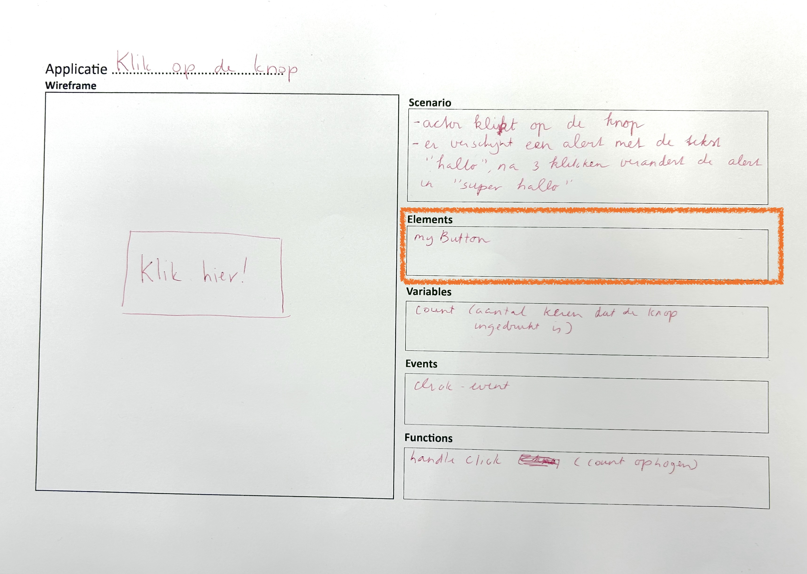
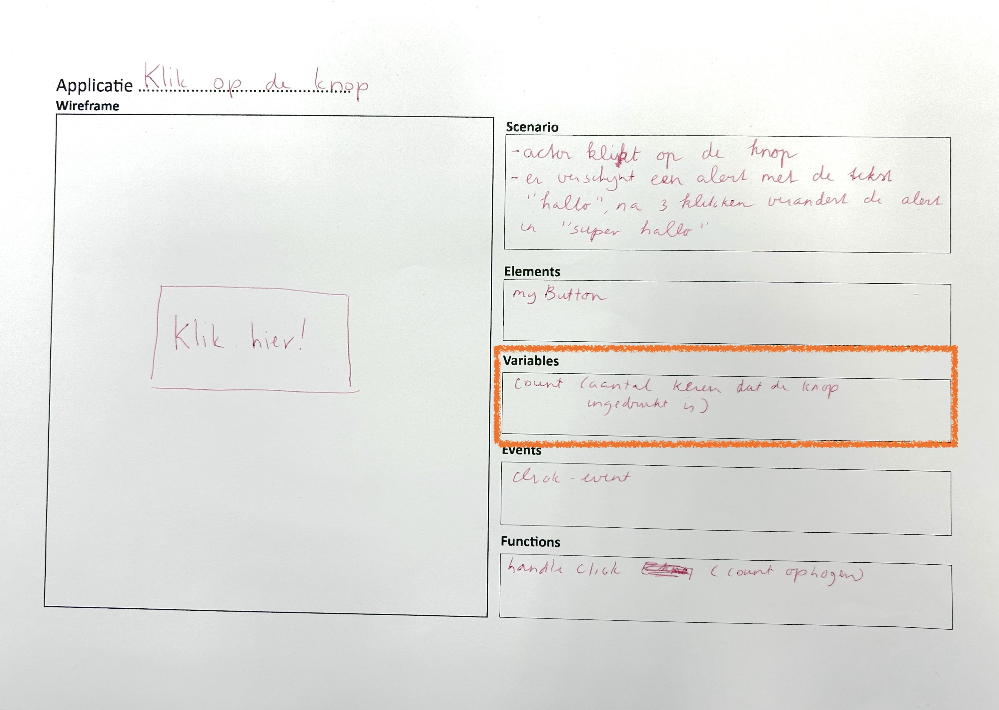
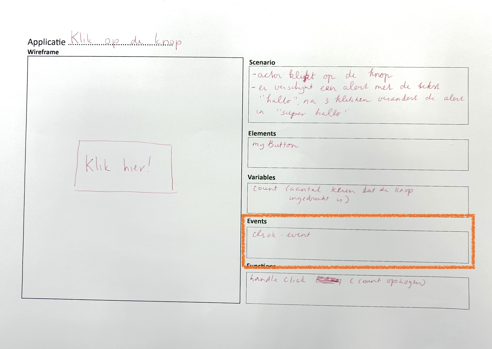
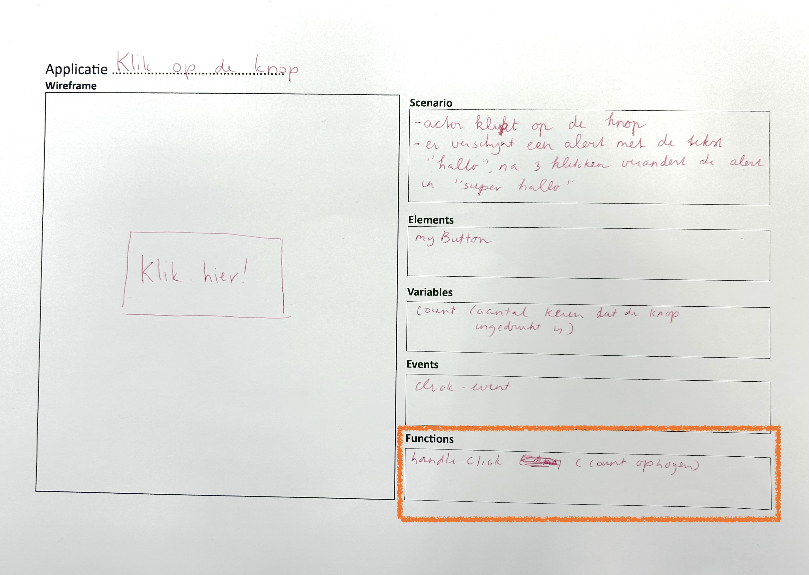

# Getting Started met een plan

Nu je bekend bent met de fundamentele concepten van JavaScript, ben je klaar om je eigen indrukwekkende applicatie te bouwen. Maar hoe start je hiermee? Een handige aanpak is het gebruik van deze [sjabloon](images/opzet-project.pdf). Deze sjabloon helpt je om een eenvoudige JavaScript-applicatie te bouwen. Het doel is om inzicht te krijgen in de basisprincipes van webontwikkeling. Door deze oefening leer je:
- Hoe je een gebruikersinterface (UI) schetst met een wireframe
- Hoe je een scenario opstelt waarin je de interactie tussen gebruiker en systeem beschrijft
- Hoe je elementen, variabelen, events en functies structureert in JavaScript

Deze aanpak is ideaal voor beginners en legt de basis voor complexere applicaties.

Met dit stappenplan ga je een simpele click-app maken.

## Stap 0: Het sjabloon
Print het [sjabloon](images/opzet-project.pdf) uit, of teken het sjabloon op een whiteboard, of wat voor jou handig is. Zolang je er maar iets op kan schrijven.

## Stap 1: Wireframe tekenen
Een wireframe is een visuele schets van je applicatie. Begin eenvoudig:

- Teken een rechthoek die je venster voorstelt.
- Teken daarin een knop met het label "Klik hier".

Dit stelt de interface voor waar de gebruiker interactie mee heeft.

## Stap 2: Scenario schrijven
Een scenario beschrijft wat de gebruiker (actor) doet en hoe het systeem reageert.

**Voorbeeldscenario**:
- Actor: Gebruiker klikt op de knop.
- Systeem: Er verschijnt een alert met de tekst "hallo". Na 3 klikken verandert de alert in "super hallo".

## Stap 3: Elements (DOM)
Maak een lijst van de HTML-elementen die je gaat gebruiken:
- MyButton (de click button)

## Stap 4: Variabelen definiëren
Identificeer de gegevens die je wilt bijhouden:
- count (aantal keer dat de knop is ingedrukt)

## Stap 5: Events
Noteer welke events je gebruikt en waar je die koppelt:
- Click-event: gekoppeld aan de button

## Stap 6: Functions
Noteer welke functions je gebruikt en aan welk event je deze koppelt:
- handleButton: gekoppeld aan het click-event

